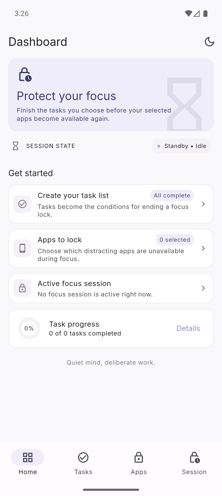
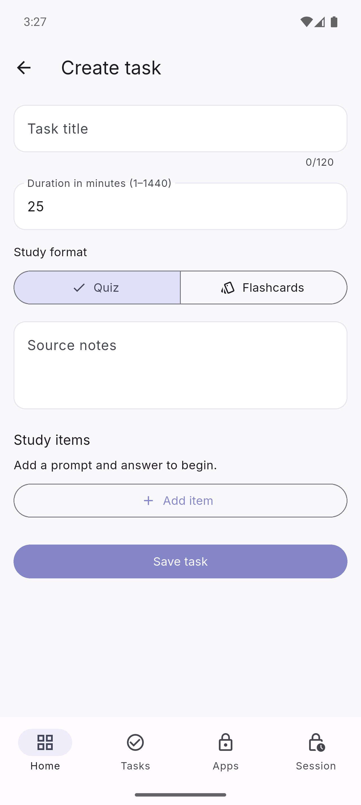
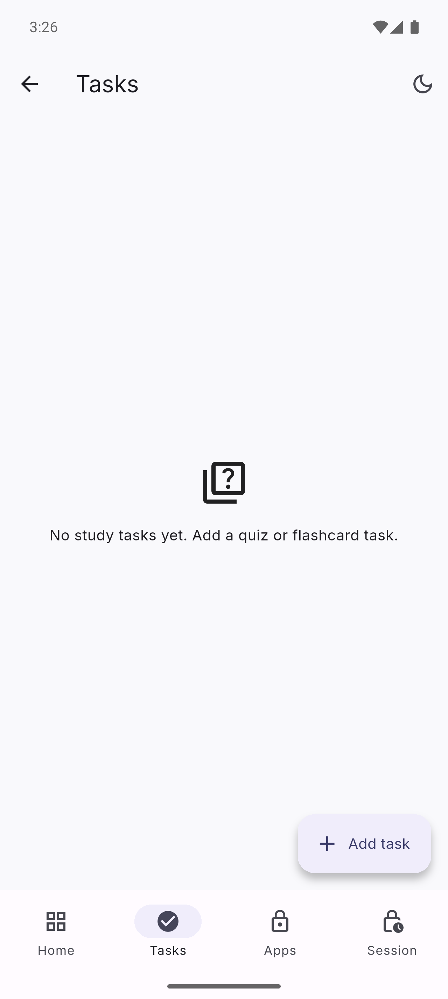
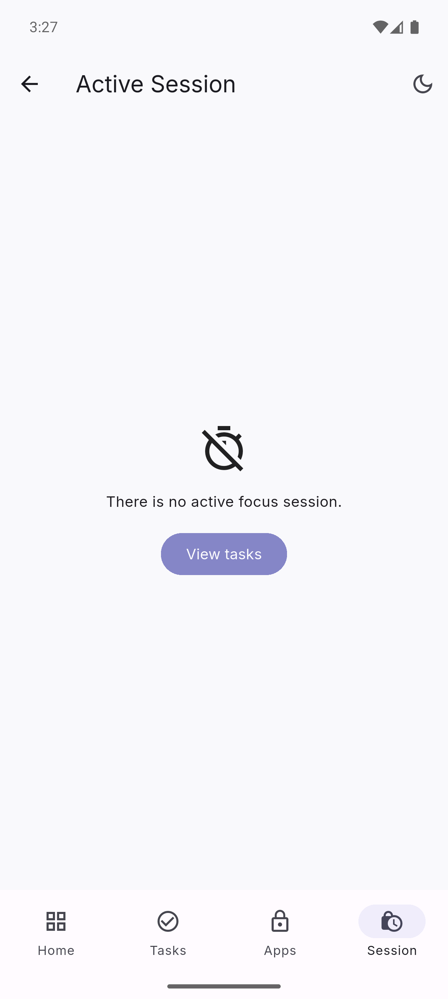

# Focus Lock

Focus Lock is an Android-first Flutter app that helps you protect focused work: choose distracting apps, create a timed study task, and keep those apps unavailable until your session ends.

## Highlights

- Create quiz or flashcard study tasks with a custom focus duration.
- Select the Android apps to keep out of reach during a session.
- Start a focus lock explicitly, then finish the task or let the timer expire to unlock.
- Keep tasks, protected-app choices, and session state locally between launches.

## Screens

  
  
  
  

<i>Dashboard · Task creation · App-lock setup · Focus session</i>

> App locking is currently implemented for Android through its accessibility service. The iOS build presents an explicit unsupported state while a platform-native approach is evaluated.

## Documentation

- [Documentation index](docs/README.md)
- [Architecture](docs/architecture.md)
- [Product feature specification](docs/product-features.md)
